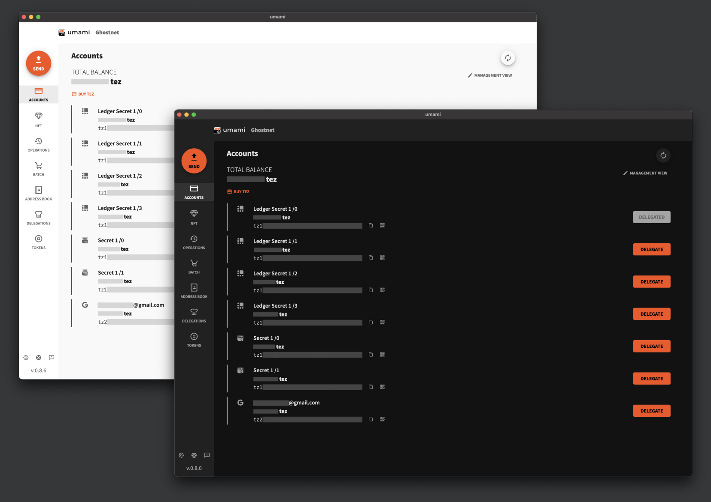

# [A powerful Tezos wallet](https://umamiwallet.com)

Umami is a cryptocurrency wallet developed by [Nomadic
Labs](https://www.nomadic-labs.com/) to interact with the [Tezos
Blockchain](https://tezos.com/). It runs as a desktop electron based app with multiple features: 

- HD Wallet
- Multiple accounts management
- Ledger support
- NFT Gallery
- FA2 and FA1.2 token support
- DApp interaction
- Batch capability (combining FA2 and FA1.2 token transfer with contract calls)
- Delegation to bakers
- Address Book
- Google login

**Umami is in Beta version.**



## 📦 Install

Install now from our [release page](https://gitlab.com/nomadic-labs/umami-wallet/umami/-/releases)

## 💻 Quick start

### 1) Clone the repository

```
git clone https://gitlab.com/nomadic-labs/umami-wallet/umami/ && cd umami
```

### 2) Requirements:

- [node](https://nodejs.org) installed, version 14 or later.
- [yarn](https://yarnpkg.com) installed.
- [`node-hid` dependencies](https://github.com/node-hid/node-hid) dependencies installed.

Linux binaries are distributed as snaps, hence it needs `snapcraft` and `LXD`:

- [snapcraft](https://snapcraft.io/docs/snapcraft-overview) installed.
- [LXD](https://snapcraft.io/docs/build-on-lxd) installed and initialized.

### 3) Build:

```
yarn
yarn bsb:build
yarn electron:build
```

The Electron binary is located in the `dist` folder. It will build an AppImage
on linux (which is not compatible with Beacon's DeepLink), but you can build the snap file using:

```
yarn snap:build
```

It will be located in the root of umami's folder.

### 4) (Optional) Run for development

Start compilation in watch mode:

```
yarn bsb:start
```

Start dev server:

```
yarn electron:dev
```

### 5) (Optional) Run tests in watch mode

If not already running, start compilation in watch mode:

```
yarn bsb:start
```

Start test runner:

```
yarn test:watch
```

### 6) (Optional) Run component catalog

If not already running, start compilation in watch mode:

```
yarn bsb:start
```

Start catalog:

```
yarn catalog:start
```

---

<br />

Need further assistance? [Ask for help.](https://gitlab.com/nomadic-labs/umami-wallet/umami/-/wikis/FAQ/Ask-for-help) 

<br>
