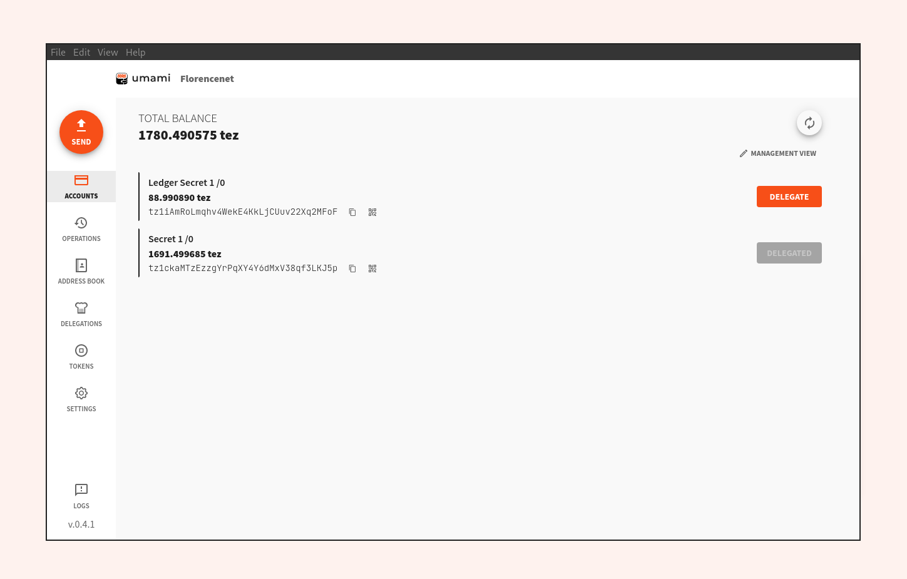

[](https://codecov.io/gl/nomadic-labs/ref-wallet)


[A powerful new Tezos wallet](https://umamiwallet.com)
===========================================================================

Umami is a cryptocurrency wallet developed by [Nomadic
 Labs](https://www.nomadic-labs.com/) to interact with the [Tezos
 Blockchain](https://tezos.com/). It runs as a desktop electron based app with
 multiple features: dApp interaction, HD Wallet, batch transfer, delegation,
 FA1.2, last operations, etc.

__Umami is in Beta version.__



## 📦 Install

Install now from our [release page](https://gitlab.com/nomadic-labs/umami-wallet/umami/-/releases)

## 💻 Quick start

### 1) Clone the repository

```
git clone https://gitlab.com/nomadic-labs/umami-wallet/umami/ && cd umami
```

### 2) Requirements:

* [node](https://nodejs.org) installed, version 14 or later.
* [yarn](https://yarnpkg.com) installed.
* [`node-hid` dependencies](https://github.com/node-hid/node-hid) dependencies installed.

Linux binaries are distributed as snaps, hence it needs `snapcraft` and `LXD`:
* [snapcraft](https://snapcraft.io/docs/snapcraft-overview) installed.
* [LXD](https://snapcraft.io/docs/build-on-lxd) installed and initialized.

On windows, a patch is needed on the `bsconfig.json`
- `git cherry-pick de5fb98079b85c41e8bc0727b8ae17e06a75a8ad`

### 3) Build:

```
yarn
yarn bsb:build
yarn electron:build
```

The Electron binary is located in the `dist` folder. It will build an AppImage
on linux (which is not compatible with Beacon's DeepLink), but you can build the snap file using:

```
yarn snap:build
```

It will be located in the root of umami's folder.

### 4) (Optional) Run for development

```
yarn electron:dev
```

## ℹ️ Support

- [open an issue](https://gitlab.com/nomadic-labs/umami-wallet/testruns/-/issues/new?issuable_template=support)
- `#umami` channel on [tezos slack](https://tezos-dev.slack.com)
- [email](mailto:incoming+nomadic-labs-umami-wallet-umami-20392089-issue-@incoming.gitlab.com)
