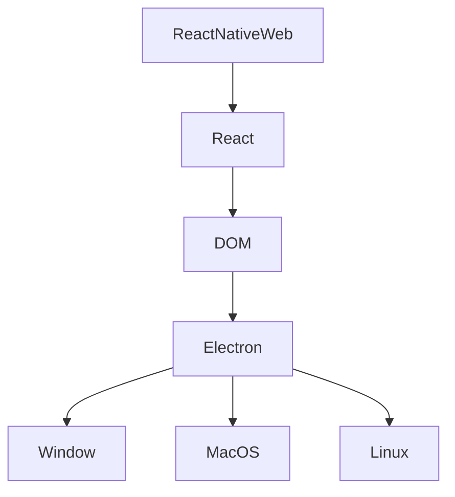

# Architecture & Tech Stack

## Front-End

### Pros & Cons

| Pros | Cons |
|--|--|
| One single codebase | Stuck in Chrome |
| Integrates well with Reason | Lack of experience internally with Electron |
| Cross OS | |
| Future Proofing portability | |
| Concept proven with Demo (see v0.1.0) | |

## Back-End

[TBD]
