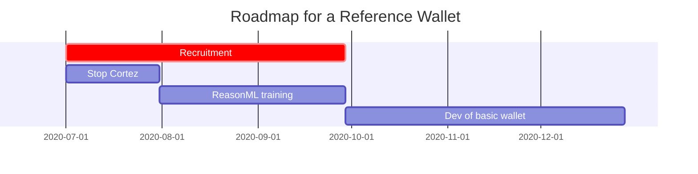

# Project Plan: Reference Wallet within Nomadic Labs

## Introduction

### Purpose

This document captures an evolving proposal/project-plan for Nomadic Labs' Reference Wallet Development Project.

The intended audience is the Tezos Foundation and its committees to discuss the approach and solicit feedback.

## Reference Wallet Development

### Features & Characteristics:

 - Written in ReasonML
 - Likely using ReasonReact framework
 - Implement all core features of Tezos (at least as much as the CLI)
 - Conform to the wallet working group conventions
 - Develop for desktop first (can be a webview)
 - Usable UX
 - Should include advanced features
 - Responsive UI (that does not appear to hang when actually in-processing)
 - Modular split: SDK vs. UI (so that others can build alternative UIs)

### Why by Nomadic Labs?

 - Proximity to the core development team
 - Strong competitive advantage
 - Quick ability to showcase new features as soon as they reach testnet/injection
 - Experienced (tezos-client, Cortez)

## HR aspects

### Roles needed

 - Experienced ReasonML lead developers (2 recruits).
 - Project Manager (Sam in interim)
 - Community coordinator (other wallets, other actors users)
 - UI/UX developer
 - Junior ReasonML developers

### What happens of the current wallet team?

 - Nomadic to transition the Cortez team onto this Project
 - Nicolas and Steve will be asked for a migration update for current users
 - They will be offered to join the new team as junior devs, to capitalize on their experience.

## Risks

  - **The market for ReasonML developers is sparse.** Mitigation: None, we'll have to try and see
  - **We lack in-house experience in UX.** Mitigation: we'll have to get help for this
  - **Retention of existing mobile talent.** Mitigation, we'll have to monitor how this goes, and set a date, with them, at which we'll decide if we stop or continue
  - **High degree of difficulty.** Mitigation: we'll plan early and often, overcommunicate, solicit feedback
  - **Increased pressure on dev teams.** Mitigation: a lot of emphasis on the team structure with a dedicated manager, and experienced developers in technologies that are familiar to the core dev team.

## Roadmap

  - Q3 2020:
    - Recruit the new team members
    - Clean stop of Cortez / convert the Cortez team to Reason ML
  - Q4 2020: basic wallet + stable development workflow
  - Q2 2021: reference wallet (beta release)
  

