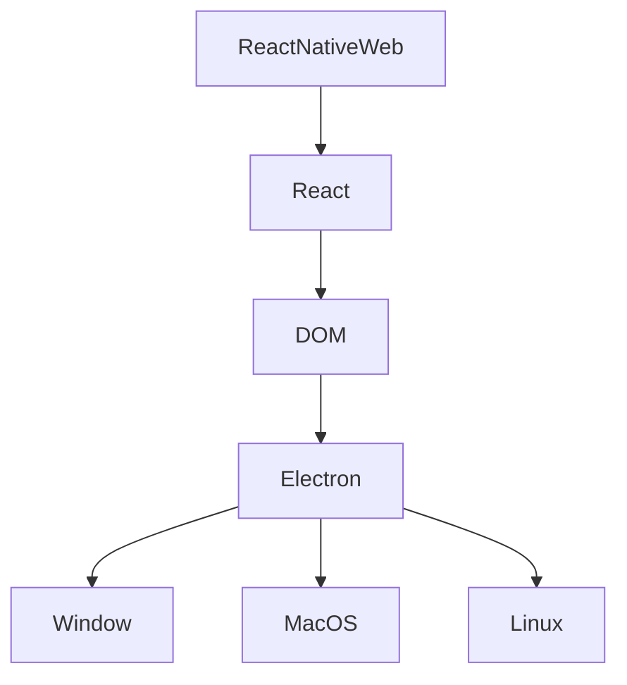
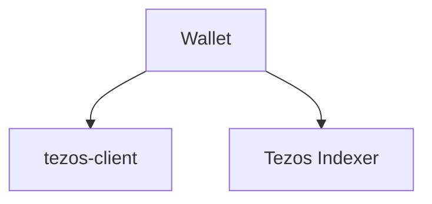
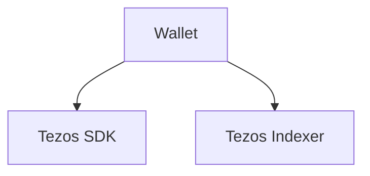
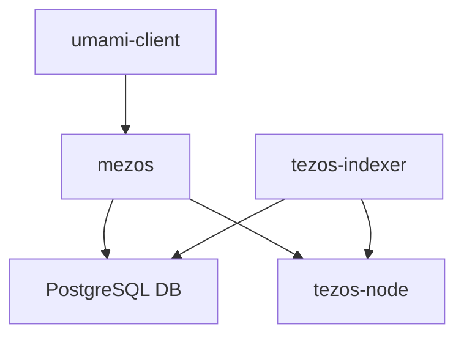

[[_TOC_]]
# Architecture & Tech Stack

This is high-level only, serves for purposes of planning the tech-stack.

For specifications, refer to [specs](/docs/specs/)

## Wallet  Front-End

### Pros & Cons

| Pros | Cons |
|--|--|
| One single codebase | Stuck in Chrome |
| Integrates well with Reason | Lack of experience internally with Electron |
| Cross OS | |
| Future Proofing portability | |
| Concept proven with Demo (see v0.1.0) | |

## Wallet tezos-client Back-end

### Current

### Target

## Wallet indexer Back-end

