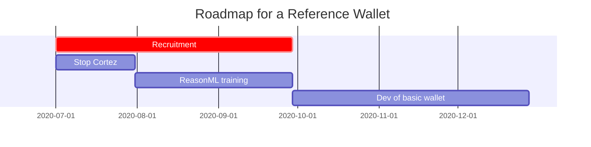
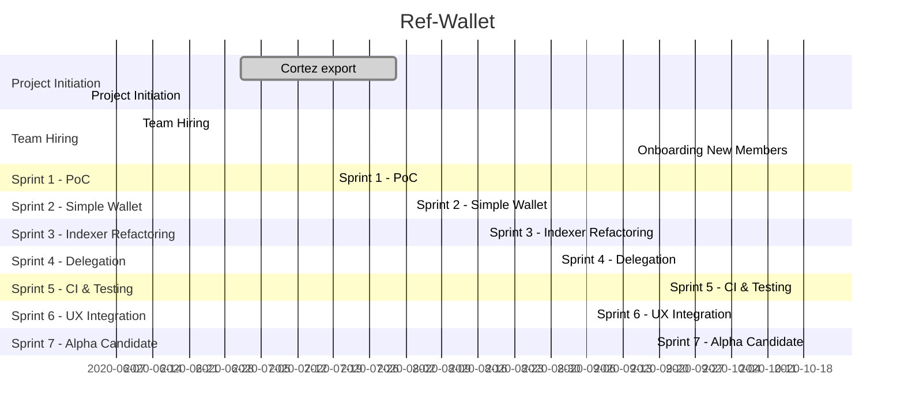

# Ref-Wallet - Project History

## Project Inception

| Date | Step |
|--|--|
| 9 May 2020 | Project was initial conceived conceptually--a Reference Wallet |
| 1 June 2020 | Proposal was drafted by NL and pitched to TF's TAC |

## Original Proposed Roadmap

Extracted from [Original Proposal](/docs/artifacts/plan_for_TAC_01_06_2020.md)

  - Q3 2020:
    - Recruit the new team members
    - Clean stop of Cortez / convert the Cortez team to Reason ML
  - Q4 2020: basic wallet + stable development workflow
  - Q2 2021: reference wallet (beta release)
  

## Actuals

