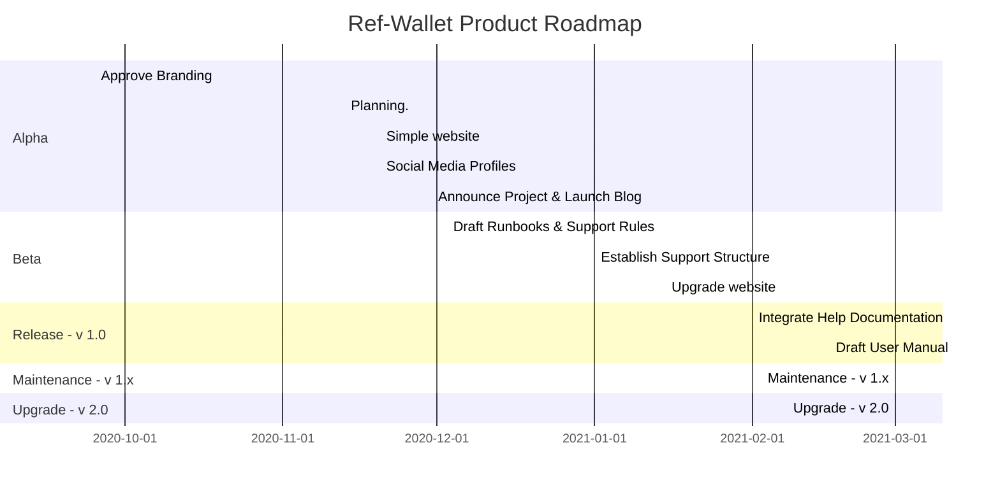

# Ref-Wallet - Product Roadmap

> As of Oct 2020

The **Product** roadmap plans the To-Market efforts to capture public attention and drive adoption.

## Projected Milestones:

 * Alpha version: Nov 2020 (internal only--usable with basic feature set)
 * Beta release: Jan 2021 (limited release--more features, some left in the backlog: TBD)
 * v1.0 release: Feb 2021 (public release--stable)
 * v1.x maintenance phase
 * v2.0 release: May 2021 (public release--no backlog)

## Strategy

 * Branding
     * Name
     * Logo/Icon
     * Theme
     * Trademark
 * Website
     * Domain
     * Graphic design
 * Social Media
     * Tweets
     * Blog
     * Community Engagement
 * Technical Support
     * L1 - Runbooks
     * Escalation Rules
     * L2 & L3 - Support Roster and Schedule
 * Documentation
     * User Manual
     * Help
     * Collaboration with Wallet Working Group

## Gantt Chart

