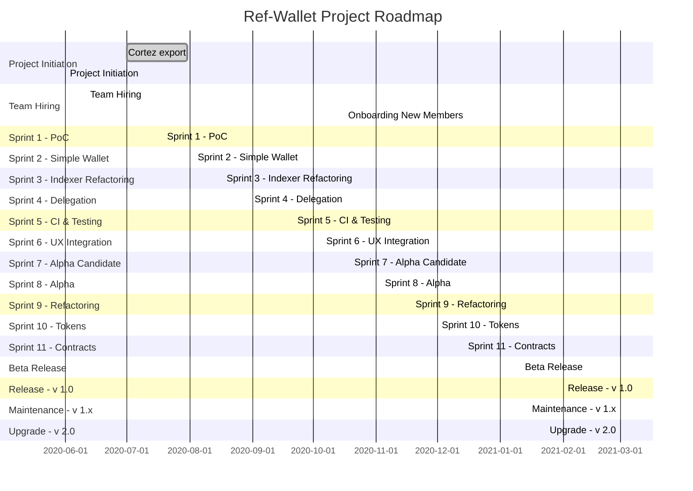

# Ref-Wallet - Project Roadmap

> as of Oct 2020

This is the **Project** Roadmap, which plans the progress of the development efforts of the Ref-Wallet.

## Projected Milestones:

 * Alpha version: Nov 2020 (internal only--usable with basic feature set)
     * Accounts
     * Aliases
     * Transactions
     * Operation History
     * Delegation
 * Beta release: Jan 2021 (limited release--more features, some left in the backlog: TBD)
     * Bulk Transactions
     * FA1.2 Tokens
     * Deploy Contracts
     * Contract Calls
 * v1.0 release: Feb 2021 (public release--stable)
 * v1.x maintenance phase
 * v2.0 release: May 2021 (public release--no backlog)
     * Voting
     * Multisig
     * FA2

 **Note**:

  * dates are pessimistic/at-latest, given best-available-data
  * dates are subject to a degree of flux if/when feature/scope is expanded
  * roadmap will be amended if extenuating circumstances occur

## Gantt Chart

