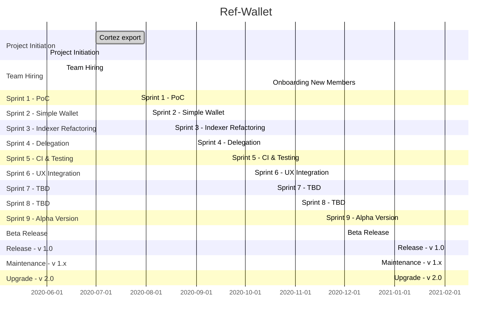

# Ref-Wallet - Roadmap

> as of Oct 2020

###Projected Milestones:

 * Alpha version: Dec 2020 (internal only--usable with basic feature set)
 * Beta release: Jan 2021 (limited release--more features, some left in the backlog: TBD)
 * v1.0 release: Feb 2021 (public release--stable)
 * v1.x maintenance phase
 * v2.0 release: Jun 2021 (public release--no backlog)

 **Note**:

  * dates are pessimistic/at-latest, given best-available-data
  * dates are subject to a degree of flux if/when feature/scope is expanded
  * roadmap will be amended if extenuating circumstances occur

## Gantt Chart

