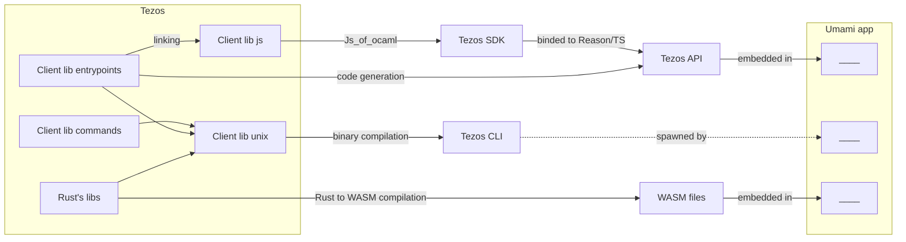

```mermaid
graph LR
  subgraph "Umami app"
  Node11[____]
  Node12[____]
  Node13[____]
  end

  subgraph "Tezos"
  Node1[Client lib entrypoints] -- linking --> Node3[Client lib js]
  Node2[Client lib commands] --> Node4
  Node1 --> Node4[Client lib unix]
  Node5[Rust's libs] --> Node4
  end
  Node5 -- Rust to WASM compilation --> Node6[WASM files]
  Node4 -- binary compilation --> Node8
  Node8[Tezos CLI] -. spawned by .-> Node12
  Node6 -- embedded in --> Node13
  Node3 -- Js_of_ocaml --> Node9[Tezos SDK]
  Node9 -- binded to Reason/TS --> Node10
  Node10[Tezos API] -- embedded in --> Node11
  Node1 -- code generation --> Node10
```
