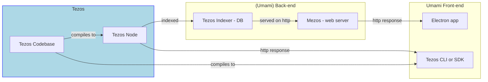

* lightblue : out of Umami team core responsability (we might have impact)
* yellow : direct Umami team impact

# Related git repos

## "back-end" 
### Tezos Codebase :
* tezos node : https://gitlab.com/nomadic-labs/tezos/-/tree/master (tezos-node unmodified)
### Umami Back-end
* (Umami&others) Back-end - Tezos Indexer - DB : https://gitlab.com/nomadic-labs/tezos-indexer
* (Umami&others) Back-end - Mezos - web server : https://gitlab.com/nomadic-labs/mezos

## "front-end"
## Umami Front-end
* Umami Front-end - Electron app : https://gitlab.com/nomadic-labs/umami
* Umami Front-end - Tezos CLI or SDK :
## Tezos Codebase :
* tezos-cli / SDK : https://gitlab.com/nomadic-labs/tezos/-/tree/umami@fa1.2+dry_run_no_pass+8.2 (back-end for Umami JS Front-end + by-pass of tezos-cli)
