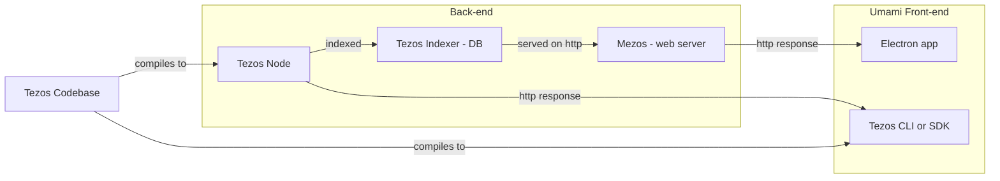

```mermaid
graph LR
   

  subgraph "Umami Front-end" 
    Node1[Electron app]
    Node3[Tezos CLI or SDK]
  end

  subgraph "Back-end"
    Node2[Tezos Node]
    Node6[Tezos Indexer - DB]
    Node7[Mezos - web server]
  end

  Node5[Tezos Codebase]

  Node5 -- compiles to --> Node3
  Node5 -- compiles to --> Node2

  Node6 -- served on http --> Node7
  Node2 -- indexed --> Node6

  Node2 -- http response --> Node3
  Node7 -- http response --> Node1
```
