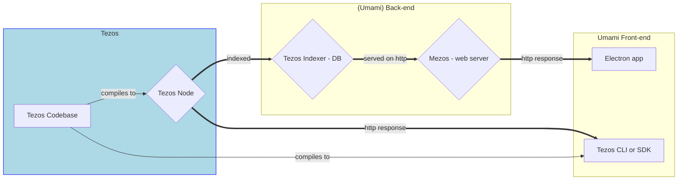

```mermaid
graph LR

subgraph "Umami Front-end" 
    Node1[Electron app]
    Node3[Tezos CLI or SDK]
end

subgraph "Tezos"
  Node2{Tezos Node}
  Node5[Tezos Codebase]
end
style Tezos fill:lightblue,stroke:blue,stroke-width:1px
subgraph "(Umami) Back-end"
     Node6{Tezos Indexer - DB}
     Node7{Mezos - web server}
end

  Node5 -- compiles to --> Node3
  Node5 -- compiles to --> Node2

  Node6 == served on http ==> Node7
  Node2 == indexed        ==> Node6

  Node2 == http response ==> Node3
  Node7 == http response ==> Node1
```

* lightblue : out of Umami team core responsability (we might have impact)
* yellow : direct Umami team impact

 
