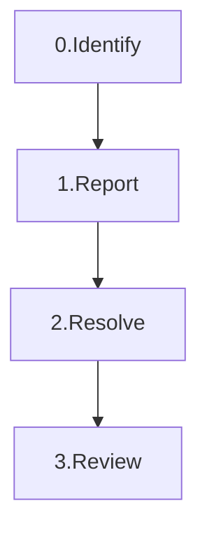

# Nomadic Labs - Umami Wallet

# Incident Management Policy

## Introduction

### Purpose

The goals of the Incident Management Policy are:

 * to ensure quality of the Umami product 
 * to organize tracking and handling of Operations
 * to responsibly address outages

### Scope

The Incident Management Policy prescribes a process with which to address Incidents in the product's live production environment.

## Overview

The Incident Management Process is as follows--from a high level perspective:

0. The Incident is identified
1. The Incident Report is filed
2. The Incident is resolved
3. The Incident is Reviewed and documented as a Post-Mortem

## Incident Identification

### Overview

An incident can be identified by the following (non-exhaustive) ways:

 * a monitoring alert is raised
 * a support issue is raised
 * a tip-off from a non-team-member
 * a discovery by a team-member
 * an event is announced that has a direct implication

### Monitoring

Monitoring is the running of jobs on the live production system that alerts members when a scenario that constitutes an Incident occurs.

The Infrastructure Manager is responsible for maintaining Monitoring; but the Umami Management is accountable for defining the Monitoring Alert rules.

Monitoring Rules are defined in [here](https://gitlab.com/nomadic-labs/umami-wallet/umami-backend/-/blob/monitoring/dockprom/prometheus/alert.rules).

### Incident Checklist

Before filing an incident report, if there are any doubt, follow the checklist to ensure you are in fact dealing with an incident:

 - [ ] 1. the situation impacts the live production environment
 - [ ] 2. the situation impacts the users access to mainnet chain services or assets
 - [ ] 3. the situation is severe or it carries a high risk; in that **any** of the following is true:
   - [ ] it will/may lead to users being unable to view their assets
   - [ ] it will/may lead to users being unable to access their assets
   - [ ] it will/may lead to downtime of the system
   - [ ] it will/may lead to downtime to a feature of the system (which is not purely informational)
 - [ ] 4. the adverse impact is urgent; in that **all** of the following is true:
   - [ ] is ongoing or is imminent
   - [ ] no straightforward workaround is possible
   - [ ] solution cannot wait for the next planned release

If you can tick boxes 1, 2, 3, and 4--you have uncovered an Incident.

## Incident Report

The Incident Report ("IR") is intended to document what is known, at the time of discovery, about the nature of the Incident.

### How to File

1. File a New Issue in the Umami main repo
2. Select "Issue Type" as "Incident"
3. Choose "Incident Report" template in "Description" field
4. Fill out the details
5. Add the **INC** label
6. Submit Issue
7. Notify IRT in Slack channel: #umami-incidents

### Composition of an IR

The acutal template is stored [here](https://gitlab.com/nomadic-labs/umami-wallet/umami/-/blob/master/.gitlab/issue_templates/Incident%20Request.md), but it's general content is as follows:

 * How the INC was discovered?
 * What is the nature of the INC?
 * What is the potential impact of the INC?
 * What is the evidence (i.e. screenshots, logs, etc)?

## Incident Response

Once the IR is filed, the INC must be handled appropriately--this becomes the responibility of the IRT.

### IRT Composition

The Incident Response Team ("IRT") is as follows:

 * Product Manager (Samuel), or Development Lead as backup (Remy)
 * Development Lead (Remy), or Pierrick as backup
 * Operations Lead (Corentin), or Philippe as backup
 * Relevent SME (whoever is most informed on technical implications)

Note: in Product Manager's absence, Development Lead can only act as one role--hence, the Development Lead backup must also be consulted.

### Handling of INC

The IRT must discuss how best to handle the INC, which may be in multiple steps.

The Incident (if handled) is to be handled by filing a separate ticket for an Emergence Change ("CHG").

#### Incident Handling Checklist

The IRT should ask themselves the following questions

 - [ ] Is the proposed solution the minimally risky approach?
 - [ ] Does the proposed solution include more changes than necessary?
 - [ ] Is the proposed solution verifiable and validate-able?
 - [ ] Is the proposed solution roll-back-able?
 - [ ] Is the proposed solution respecting the order of quality? (See Goals in Introduction)
 - [ ] Did the IRT exhaust all possible solutions?

### Verification vs Validation

The CHG filed to handle the INC at issue, may be successfully verified, but may not be valid in the sense that it may not properly or completely address the INC.

## Incident Post-Mortem ("IPM")

A review of the INC and its handling is to be performed, in order to:

 * assess whether a follow up CHG is necessary
 * assess whether the INC handling was appropriate
 * assess whether a policy change is recommended
 * assess whether a feature request is appropriate

### Following up on an IPM

In the INC ticket, add a final report in the end as a comment

The template is stored [here](https://gitlab.com/nomadic-labs/umami-wallet/umami/-/blob/master/.gitlab/issue_templates/Incident%20Port-Mortem.md), but it's general content is as follows:

 * What is the root cause analysis of the INC?
 * What was the actual adverse impact of the INC?
 * Are there follow up recommendations?

### IPM Meeting

A weekly IPM meeting is to be held.

Prior to the meeting, the IPM(s) should have been filed for review.

Each IPM is to be discussed, reviewed and approved by management.

#### IPM Meeting Agenda Checklist

 - [ ] Could the INC have been handled better?
 - [ ] Are the alerts defined appropriately?
 - [ ] Is there another test case/scenario to add to prevent/catch a similar INC from occuring?
 - [ ] Is there an infrastructure change or a code change that would prevent the INC reoccurence?
 - [ ] Is there an infrastructure change or a code change that would enhance the ability to handle a similar INC?

## RACI (Responsible Accountable Consult Inform) Chart

| Party Abbr. | Title | Member(s) |
|--|--|--|
| PM | Product Manager | Samuel, or Remy as backup |
| DL | Development Lead | Remy, or Pierrick as backup |
| OM | Operations Manager | Corentin, or Philippe as backup |
| IRT | Incident Response Team | PM, DL and OM |
| SME | Subject Matter Expert | Whoever is most appropriately knowledgeable and available member for an ongoing incident |

| Task | Responsible | Accountable | Consult | Inform |
|--|--|--|--|--|
| Drafting and Maintaining Policy | PM | PM | DL, OM | All |
| Chairing the IPM | PM | PM | DL, OM | - |
| File an IR | Member who discovered | Member who filed | - | IRT |
| Decide how to handle INC | IRT | PM | SME | - |
| File Emergency CHG | IRT | PM | SME | - |
| Post-Mortem | IRT | PM | SME | - |
