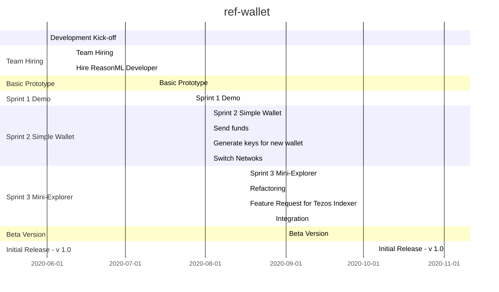

```mermaid
gantt
    title ref-wallet
    Development Kick-off                    :done, 2020-06-01, 2020-07-13
    section Team Hiring
    Team Hiring                             :active, 2020-06-11, 2020-09-30
    Hire ReasonML Developer                 :active, 2020-06-11, 2020-08-31
    section Basic Prototype
    Basic Prototype                         :done, 2020-07-13, 2020-07-26
    section Sprint 1 Demo
    Sprint 1 Demo                           :done, 2020-07-27, 2020-07-31
    section Sprint 2 Simple Wallet
    Sprint 2 Simple Wallet                  :active, 2020-08-03, 2020-08-14
    Send funds                              :done, 2020-08-03, 2020-08-07
    Generate keys for new wallet            :active, 2020-08-03, 2020-08-14
    Switch Netwoks                          :active, 2020-08-03, 2020-08-14
    section Sprint 3 Mini-Explorer
    Sprint 3 Mini-Explorer                  :active, 2020-08-17, 2020-08-31
    Refactoring                             :active, 2020-08-17, 2020-08-24
    Feature Request for Tezos Indexer       :active, 2020-08-17, 2020-08-24
    Integration                             :active, 2020-08-27, 2020-08-31
    section Beta Version
    Beta Version                            :active, 2020-09-01, 2020-10-30
    section Initial Release - v 1.0
    Initial Release - v 1.0                 :active, 2020-11-02, 2021-01-31
```