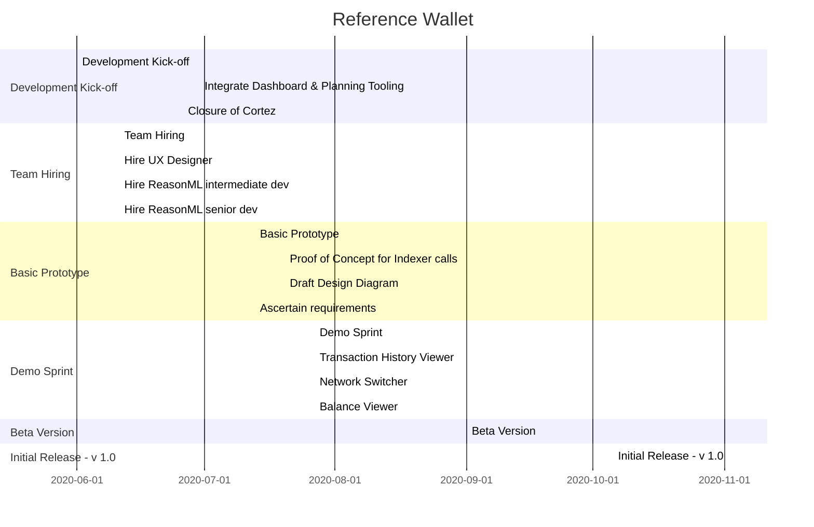

```mermaid
gantt
    title Reference Wallet
    section Development Kick-off
    Development Kick-off                    :done, 2020-06-01, 2020-07-13
    Integrate Dashboard & Planning Tooling  :done, 2020-06-30, 2020-07-13
    Closure of Cortez                       :done, 2020-06-26, 2020-07-13
    section Team Hiring
    Team Hiring                             :active, 2020-06-11, 2020-09-30
    Hire UX Designer                        :active, 2020-06-11, 2020-09-30
    Hire ReasonML intermediate dev          :active, 2020-06-11, 2020-09-30
    Hire ReasonML senior dev                :done, 2020-06-11, 2020-07-20
    section Basic Prototype
    Basic Prototype                         :active, 2020-07-13, 2020-08-31
    Proof of Concept for Indexer calls      :done, 2020-07-20, 2020-07-24
    Draft Design Diagram                    :done, 2020-07-20, 2020-07-27
    Ascertain requirements                  :done, 2020-07-13, 2020-07-24
    section Demo Sprint
    Demo Sprint                             :active, 2020-07-27, 2020-07-31
    Transaction History Viewer              :active, 2020-07-27, 2020-07-31
    Network Switcher                        :active, 2020-07-27, 2020-07-31
    Balance Viewer                          :active, 2020-07-27, 2020-07-31
    section Beta Version
    Beta Version                            :active, 2020-09-01, 2020-10-30
    section Initial Release - v 1.0
    Initial Release - v 1.0                 :active, 2020-11-02, 2021-01-31
```