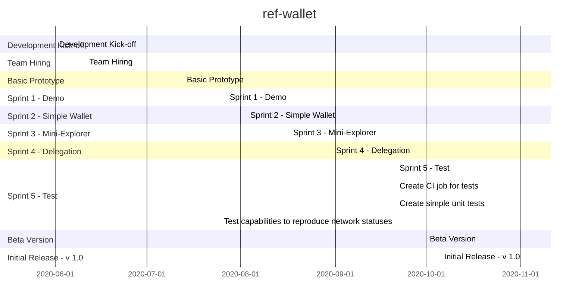

```mermaid
gantt
    title ref-wallet
    section Development Kick-off
    Development Kick-off                              :done  , 2020-06-01, 2020-07-13
    section Team Hiring
    Team Hiring                                       :done  , 2020-06-11, 2020-09-01
    section Basic Prototype
    Basic Prototype                                   :done  , 2020-07-13, 2020-08-31
    section Sprint 1 - Demo
    Sprint 1 - Demo                                   :done  , 2020-07-27, 2020-07-31
    section Sprint 2 - Simple Wallet
    Sprint 2 - Simple Wallet                          :done  , 2020-08-03, 2020-08-14
    section Sprint 3 - Mini-Explorer
    Sprint 3 - Mini-Explorer                          :done  , 2020-08-17, 2020-08-28
    section Sprint 4 - Delegation
    Sprint 4 - Delegation                             :done  , 2020-08-31, 2020-09-18
    section Sprint 5 - Test
    Sprint 5 - Test                                   :active, 2020-09-21, 2020-10-02
    Create CI job for tests                           :active, 2020-09-21, 2020-10-21
    Create simple unit tests                          :active, 2020-09-21, 2020-10-21
    Test capabilities to reproduce network statuses   :active, 2020-09-21, 2020-10-21
    section Beta Version
    Beta Version                                      :active, 2020-10-01, 2020-10-30
    section Initial Release - v 1.0
    Initial Release - v 1.0                           :active, 2020-11-02, 2021-01-31
```
